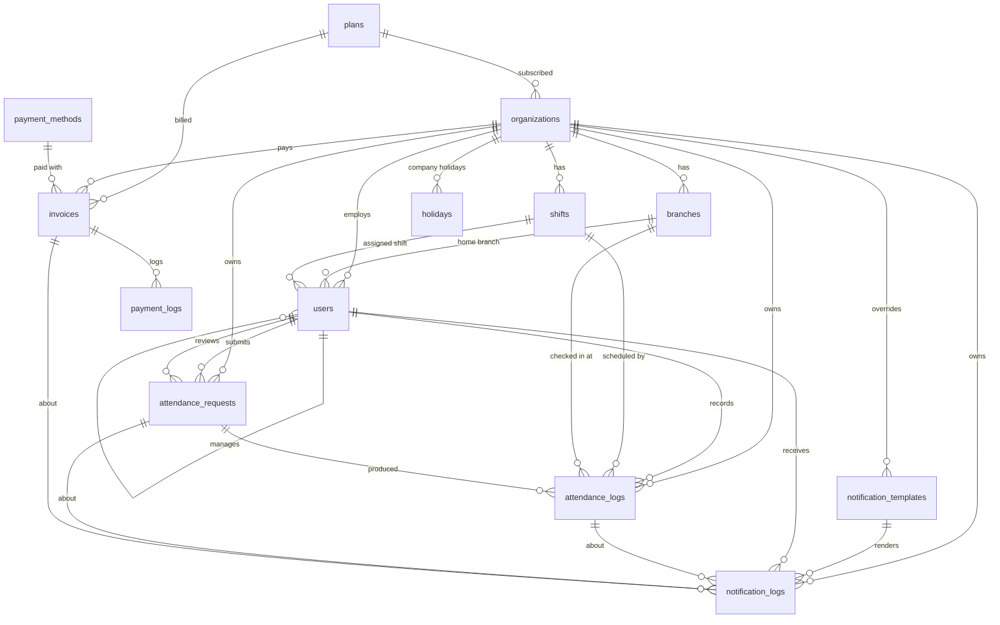

# ERD — Hadirin

> Physical schema (PostgreSQL 16 on Neon) + idempotent realistic seed.
> Conventions: `BIGSERIAL`/`BIGINT` keys (no UUID) · `VARCHAR` + documented values (no native ENUM) · every relation is a real FK · `TIMESTAMPTZ` for instants, `DATE`/`TIME` for calendar values · money in integer rupiah (`BIGINT`).

Related: [PRD.md](PRD.md) · [TRD.md](TRD.md) · [AGENTS.md](AGENTS.md)

---

## 1. Data classes: static vs CMS vs tenant vs transactional

The most important design decision: what lives in code, what an admin edits in a CMS screen, and what only the system writes.

| Class | Where it lives | Who changes it | Cache | Tables / values |
|---|---|---|---|---|
| **Static (code constants)** | `lib/constants/*.ts`, documented below | Developers, via deploy | Bundled | Roles, statuses, request types, sources, channels, notification event triggers, geofence modes, ISO weekday mapping |
| **Platform CMS** | DB, edited in `/platform` | Platform admin | Upstash, 1 h, busted on write | `plans`, `payment_methods`, global `notification_templates` (`org_id IS NULL`), national `holidays` (`org_id IS NULL`) |
| **Tenant CMS / master data** | DB, edited in `/app` | Org OWNER/ADMIN | Upstash, 10 min, busted on write | `organizations` (own row), `branches`, `shifts`, `users`, company `holidays`, template overrides |
| **Transactional** | DB, system-written | Never edited through a CMS | Short (20–60 s) or none | `attendance_logs`, `attendance_requests`, `invoices`, `payment_logs`, `notification_logs` |

Rule of thumb: if a value is referenced in `if` statements in code, it is **static**. If it only changes what is shown or charged, it is **CMS**.

### 1.1 Static value sets (VARCHAR valid values)

| Column | Valid values |
|---|---|
| `platform_admins.role` | `SUPERADMIN`, `SUPPORT` |
| `platform_admins.status`, `users.status` | `ACTIVE`, `INACTIVE` |
| `organizations.status` | `TRIAL`, `ACTIVE`, `PAST_DUE`, `SUSPENDED` |
| `organizations.geofence_mode` | `STRICT` (reject outside radius), `FLAG` (accept + flag) |
| `users.role` | `OWNER`, `ADMIN`, `MANAGER`, `EMPLOYEE` |
| `attendance_logs.status` | `PRESENT`, `LATE`, `ABSENT`, `LEAVE`, `SICK`, `PERMIT`, `HOLIDAY`, `OFF` |
| `attendance_logs.source` | `APP`, `REQUEST`, `SYSTEM` |
| `attendance_requests.type` | `CORRECTION`, `LEAVE`, `SICK`, `PERMIT` |
| `attendance_requests.status` | `PENDING`, `APPROVED`, `REJECTED`, `CANCELLED` |
| `payment_methods.type` | `QRIS`, `EWALLET`, `VA`, `CARD` |
| `payment_methods.code` | Midtrans `enabled_payments` codes: `other_qris`, `gopay`, `shopeepay`, `bca_va`, `bni_va`, `bri_va`, `echannel`, `permata_va`, `credit_card` |
| `invoices.status` | `PENDING`, `PAID`, `EXPIRED`, `FAILED`, `REFUNDED` |
| `payment_logs.direction` | `REQUEST`, `WEBHOOK` |
| `notification_templates.event_trigger` | `LATE_CHECK_IN`, `MISSING_CHECK_OUT`, `REQUEST_SUBMITTED`, `REQUEST_REVIEWED`, `INVOICE_CREATED`, `INVOICE_PAID` |
| `notification_*.channel` | `EMAIL`, `WHATSAPP` |
| `notification_logs.status` | `QUEUED`, `SENT`, `FAILED` |
| `shifts.work_days` | Comma list of ISO weekdays, `1`=Mon … `7`=Sun, e.g. `1,2,3,4,5` |

**Tracked user** = `users.shift_id IS NOT NULL`. Only tracked users can check in and only they get ABSENT/HOLIDAY rows. Owners who don't clock in keep `shift_id` NULL.

**Seat** = a `users` row with `status = 'ACTIVE'` (any role). Seats are checked against `plans.max_employees`.

## 2. Diagram



`platform_admins` stands alone (no tenant).

## 3. Schema

The Drizzle schema in `db/schema.ts` must produce exactly this. Indexes Drizzle cannot express (`INCLUDE`, expression uniques) go into a custom migration (`drizzle-kit generate --custom`).

```sql
-- =========================================================
-- PLATFORM
-- =========================================================
CREATE TABLE plans (
  id              BIGSERIAL PRIMARY KEY,
  code            VARCHAR(30)  NOT NULL UNIQUE,
  name            VARCHAR(60)  NOT NULL,
  price_monthly   BIGINT       NOT NULL DEFAULT 0 CHECK (price_monthly >= 0),
  max_employees   INT          NOT NULL CHECK (max_employees > 0),
  max_branches    INT          NOT NULL CHECK (max_branches > 0),
  features        JSONB        NOT NULL DEFAULT '{}'::jsonb,
  is_active       BOOLEAN      NOT NULL DEFAULT TRUE,
  sort_order      INT          NOT NULL DEFAULT 0,
  created_at      TIMESTAMPTZ  NOT NULL DEFAULT now(),
  updated_at      TIMESTAMPTZ  NOT NULL DEFAULT now()
);

CREATE TABLE platform_admins (
  id              BIGSERIAL PRIMARY KEY,
  name            VARCHAR(100) NOT NULL,
  email           VARCHAR(150) NOT NULL,
  password_hash   VARCHAR(255) NOT NULL,
  role            VARCHAR(20)  NOT NULL DEFAULT 'SUPERADMIN',
  status          VARCHAR(20)  NOT NULL DEFAULT 'ACTIVE',
  created_at      TIMESTAMPTZ  NOT NULL DEFAULT now()
);
CREATE UNIQUE INDEX uq_platform_admins_email ON platform_admins (lower(email));

CREATE TABLE payment_methods (
  id              BIGSERIAL PRIMARY KEY,
  code            VARCHAR(30)  NOT NULL UNIQUE,
  name            VARCHAR(80)  NOT NULL,
  type            VARCHAR(20)  NOT NULL,
  logo_url        VARCHAR(500),
  admin_fee_flat  BIGINT       NOT NULL DEFAULT 0,
  admin_fee_pct   NUMERIC(5,2) NOT NULL DEFAULT 0.00,
  is_active       BOOLEAN      NOT NULL DEFAULT TRUE,
  sort_order      INT          NOT NULL DEFAULT 0,
  updated_at      TIMESTAMPTZ  NOT NULL DEFAULT now()
);
CREATE INDEX idx_payment_methods_active ON payment_methods (sort_order) WHERE is_active;

-- =========================================================
-- TENANT
-- =========================================================
CREATE TABLE organizations (
  id               BIGSERIAL PRIMARY KEY,
  plan_id          BIGINT       NOT NULL REFERENCES plans(id) ON DELETE RESTRICT,
  name             VARCHAR(120) NOT NULL,
  slug             VARCHAR(60)  NOT NULL UNIQUE,
  timezone         VARCHAR(40)  NOT NULL DEFAULT 'Asia/Jakarta',
  status           VARCHAR(20)  NOT NULL DEFAULT 'TRIAL',
  geofence_mode    VARCHAR(10)  NOT NULL DEFAULT 'STRICT',
  selfie_required  BOOLEAN      NOT NULL DEFAULT TRUE,
  logo_url         VARCHAR(500),
  trial_ends_at    TIMESTAMPTZ,
  plan_expires_at  TIMESTAMPTZ,
  created_at       TIMESTAMPTZ  NOT NULL DEFAULT now(),
  updated_at       TIMESTAMPTZ  NOT NULL DEFAULT now()
);
CREATE INDEX idx_organizations_plan ON organizations (plan_id);
CREATE INDEX idx_organizations_expiry ON organizations (plan_expires_at) WHERE status IN ('ACTIVE','PAST_DUE');

CREATE TABLE branches (
  id          BIGSERIAL PRIMARY KEY,
  org_id      BIGINT       NOT NULL REFERENCES organizations(id) ON DELETE CASCADE,
  name        VARCHAR(100) NOT NULL,
  address     VARCHAR(255),
  latitude    NUMERIC(9,6) NOT NULL CHECK (latitude BETWEEN -90 AND 90),
  longitude   NUMERIC(9,6) NOT NULL CHECK (longitude BETWEEN -180 AND 180),
  radius_m    INT          NOT NULL DEFAULT 100 CHECK (radius_m BETWEEN 10 AND 5000),
  is_active   BOOLEAN      NOT NULL DEFAULT TRUE,
  created_at  TIMESTAMPTZ  NOT NULL DEFAULT now(),
  updated_at  TIMESTAMPTZ  NOT NULL DEFAULT now(),
  CONSTRAINT uq_branches_org_name UNIQUE (org_id, name)
);
CREATE INDEX idx_branches_org_active ON branches (org_id) WHERE is_active;

CREATE TABLE shifts (
  id                      BIGSERIAL PRIMARY KEY,
  org_id                  BIGINT      NOT NULL REFERENCES organizations(id) ON DELETE CASCADE,
  name                    VARCHAR(60) NOT NULL,
  time_in                 TIME        NOT NULL,
  time_out                TIME        NOT NULL,
  break_minutes           INT         NOT NULL DEFAULT 60 CHECK (break_minutes >= 0),
  late_tolerance_minutes  INT         NOT NULL DEFAULT 0  CHECK (late_tolerance_minutes >= 0),
  work_days               VARCHAR(20) NOT NULL DEFAULT '1,2,3,4,5',
  is_cross_day            BOOLEAN     NOT NULL DEFAULT FALSE,
  is_active               BOOLEAN     NOT NULL DEFAULT TRUE,
  created_at              TIMESTAMPTZ NOT NULL DEFAULT now(),
  updated_at              TIMESTAMPTZ NOT NULL DEFAULT now(),
  CONSTRAINT uq_shifts_org_name UNIQUE (org_id, name)
);
CREATE INDEX idx_shifts_org ON shifts (org_id);

CREATE TABLE users (
  id             BIGSERIAL PRIMARY KEY,
  org_id         BIGINT       NOT NULL REFERENCES organizations(id) ON DELETE CASCADE,
  branch_id      BIGINT       REFERENCES branches(id) ON DELETE SET NULL,
  shift_id       BIGINT       REFERENCES shifts(id)   ON DELETE SET NULL,
  manager_id     BIGINT       REFERENCES users(id)    ON DELETE SET NULL,
  employee_code  VARCHAR(30),
  name           VARCHAR(100) NOT NULL,
  email          VARCHAR(150),             -- login id #1 (optional: many field staff have none)
  phone          VARCHAR(20),              -- login id #2, E.164 (+62…)
  password_hash  VARCHAR(255) NOT NULL,
  must_change_password BOOLEAN NOT NULL DEFAULT FALSE,
  role           VARCHAR(20)  NOT NULL DEFAULT 'EMPLOYEE',
  position       VARCHAR(80),
  avatar_url     VARCHAR(500),
  status         VARCHAR(20)  NOT NULL DEFAULT 'ACTIVE',
  joined_at      DATE,
  last_login_at  TIMESTAMPTZ,
  created_at     TIMESTAMPTZ  NOT NULL DEFAULT now(),
  updated_at     TIMESTAMPTZ  NOT NULL DEFAULT now(),
  CONSTRAINT ck_users_login_id CHECK (email IS NOT NULL OR phone IS NOT NULL)
);
CREATE UNIQUE INDEX uq_users_email     ON users (lower(email)) WHERE email IS NOT NULL;
CREATE UNIQUE INDEX uq_users_phone     ON users (phone) WHERE phone IS NOT NULL;
CREATE UNIQUE INDEX uq_users_org_code  ON users (org_id, employee_code) WHERE employee_code IS NOT NULL;
CREATE INDEX idx_users_org_status_role ON users (org_id, status, role);
CREATE INDEX idx_users_branch          ON users (branch_id);
CREATE INDEX idx_users_shift           ON users (shift_id);
CREATE INDEX idx_users_manager         ON users (manager_id);

CREATE TABLE holidays (
  id                   BIGSERIAL PRIMARY KEY,
  org_id               BIGINT       REFERENCES organizations(id) ON DELETE CASCADE, -- NULL = national
  holiday_date         DATE         NOT NULL,
  name                 VARCHAR(120) NOT NULL,
  is_collective_leave  BOOLEAN      NOT NULL DEFAULT FALSE,
  created_at           TIMESTAMPTZ  NOT NULL DEFAULT now()
);
CREATE UNIQUE INDEX uq_holidays_scope_date ON holidays (COALESCE(org_id, 0), holiday_date);
CREATE INDEX idx_holidays_date ON holidays (holiday_date);

-- =========================================================
-- ATTENDANCE (hot path)
-- =========================================================
CREATE TABLE attendance_requests (
  id                   BIGSERIAL PRIMARY KEY,
  org_id               BIGINT       NOT NULL REFERENCES organizations(id) ON DELETE CASCADE,
  user_id              BIGINT       NOT NULL REFERENCES users(id) ON DELETE CASCADE,
  type                 VARCHAR(20)  NOT NULL,
  date_from            DATE         NOT NULL,
  date_to              DATE         NOT NULL,
  requested_check_in   TIME,
  requested_check_out  TIME,
  reason               VARCHAR(500) NOT NULL,
  attachment_url       VARCHAR(500),
  status               VARCHAR(20)  NOT NULL DEFAULT 'PENDING',
  reviewed_by          BIGINT       REFERENCES users(id) ON DELETE SET NULL,
  reviewed_at          TIMESTAMPTZ,
  review_note          VARCHAR(255),
  created_at           TIMESTAMPTZ  NOT NULL DEFAULT now(),
  updated_at           TIMESTAMPTZ  NOT NULL DEFAULT now(),
  CONSTRAINT ck_requests_range CHECK (date_to >= date_from),
  CONSTRAINT ck_requests_correction_single_day CHECK (type <> 'CORRECTION' OR date_to = date_from)
);
-- Approval inbox: tiny partial index, only PENDING rows.
CREATE INDEX idx_requests_pending     ON attendance_requests (org_id, created_at DESC) WHERE status = 'PENDING';
CREATE INDEX idx_requests_org_status  ON attendance_requests (org_id, status, date_from);
CREATE INDEX idx_requests_user        ON attendance_requests (user_id, created_at DESC);
CREATE INDEX idx_requests_reviewed_by ON attendance_requests (reviewed_by);

CREATE TABLE attendance_logs (
  id                     BIGSERIAL PRIMARY KEY,
  org_id                 BIGINT       NOT NULL REFERENCES organizations(id) ON DELETE CASCADE,
  user_id                BIGINT       NOT NULL REFERENCES users(id) ON DELETE CASCADE,
  shift_id               BIGINT       REFERENCES shifts(id) ON DELETE SET NULL,
  request_id             BIGINT       REFERENCES attendance_requests(id) ON DELETE SET NULL,
  work_date              DATE         NOT NULL,
  scheduled_in           TIME,
  scheduled_out          TIME,
  check_in_at            TIMESTAMPTZ,
  check_in_branch_id     BIGINT       REFERENCES branches(id) ON DELETE SET NULL,
  check_in_lat           NUMERIC(9,6),
  check_in_lng           NUMERIC(9,6),
  check_in_accuracy_m    INT,
  check_in_distance_m    INT,
  check_in_photo_url     VARCHAR(500),
  check_in_is_outside    BOOLEAN      NOT NULL DEFAULT FALSE,
  check_out_at           TIMESTAMPTZ,
  check_out_branch_id    BIGINT       REFERENCES branches(id) ON DELETE SET NULL,
  check_out_lat          NUMERIC(9,6),
  check_out_lng          NUMERIC(9,6),
  check_out_accuracy_m   INT,
  check_out_distance_m   INT,
  check_out_photo_url    VARCHAR(500),
  check_out_is_outside   BOOLEAN      NOT NULL DEFAULT FALSE,
  status                 VARCHAR(20)  NOT NULL DEFAULT 'PRESENT',
  late_minutes           INT          NOT NULL DEFAULT 0,
  early_leave_minutes    INT          NOT NULL DEFAULT 0,
  work_minutes           INT,
  note                   VARCHAR(255),
  source                 VARCHAR(20)  NOT NULL DEFAULT 'APP',
  created_at             TIMESTAMPTZ  NOT NULL DEFAULT now(),
  updated_at             TIMESTAMPTZ  NOT NULL DEFAULT now(),
  CONSTRAINT uq_attendance_user_date UNIQUE (user_id, work_date),
  CONSTRAINT ck_attendance_out_after_in CHECK (check_out_at IS NULL OR check_in_at IS NULL OR check_out_at > check_in_at)
);
-- uq_attendance_user_date also serves "my history" (user_id, work_date DESC via backward scan)
-- and makes check-in idempotent (INSERT ... ON CONFLICT DO NOTHING).

-- Dashboard + recap: index-only scan for a whole org-month.
CREATE INDEX idx_att_org_date_cover ON attendance_logs (org_id, work_date)
  INCLUDE (user_id, status, late_minutes, work_minutes, check_in_is_outside);
-- "Checked in but not out" widget + close-day job.
CREATE INDEX idx_att_open ON attendance_logs (org_id, work_date)
  WHERE check_in_at IS NOT NULL AND check_out_at IS NULL;
-- "Outside area" widget.
CREATE INDEX idx_att_outside ON attendance_logs (org_id, work_date)
  WHERE check_in_is_outside OR check_out_is_outside;
-- FK support (ON DELETE SET NULL scans).
CREATE INDEX idx_att_shift          ON attendance_logs (shift_id);
CREATE INDEX idx_att_request        ON attendance_logs (request_id) WHERE request_id IS NOT NULL;
CREATE INDEX idx_att_in_branch      ON attendance_logs (check_in_branch_id);
CREATE INDEX idx_att_out_branch     ON attendance_logs (check_out_branch_id);

-- =========================================================
-- BILLING
-- =========================================================
CREATE TABLE invoices (
  id                       BIGSERIAL PRIMARY KEY,
  org_id                   BIGINT       NOT NULL REFERENCES organizations(id) ON DELETE CASCADE,
  plan_id                  BIGINT       NOT NULL REFERENCES plans(id) ON DELETE RESTRICT,
  payment_method_id        BIGINT       REFERENCES payment_methods(id) ON DELETE SET NULL,
  invoice_code             VARCHAR(40)  NOT NULL UNIQUE,
  midtrans_order_id        VARCHAR(50)  UNIQUE,          -- {invoice_code}-{attempt}; new attempt when the method changes
  period_start             DATE         NOT NULL,
  period_end               DATE         NOT NULL,
  employee_count           INT          NOT NULL,
  amount                   BIGINT       NOT NULL,
  admin_fee                BIGINT       NOT NULL DEFAULT 0,
  total_amount             BIGINT       NOT NULL,
  status                   VARCHAR(20)  NOT NULL DEFAULT 'PENDING',
  snap_token               VARCHAR(100),
  snap_redirect_url        VARCHAR(500),
  midtrans_transaction_id  VARCHAR(64),
  paid_at                  TIMESTAMPTZ,
  expires_at               TIMESTAMPTZ,
  created_at               TIMESTAMPTZ  NOT NULL DEFAULT now(),
  updated_at               TIMESTAMPTZ  NOT NULL DEFAULT now(),
  CONSTRAINT ck_invoices_period CHECK (period_end >= period_start)
);
CREATE INDEX idx_invoices_org      ON invoices (org_id, created_at DESC);
CREATE INDEX idx_invoices_pending  ON invoices (expires_at) WHERE status = 'PENDING';
CREATE INDEX idx_invoices_plan     ON invoices (plan_id);
CREATE INDEX idx_invoices_method   ON invoices (payment_method_id);

CREATE TABLE payment_logs (
  id                BIGSERIAL PRIMARY KEY,
  invoice_id        BIGINT       NOT NULL REFERENCES invoices(id) ON DELETE CASCADE,
  direction         VARCHAR(10)  NOT NULL,
  endpoint          VARCHAR(255),
  request_payload   JSONB,
  response_payload  JSONB,
  http_status       INT,
  created_at        TIMESTAMPTZ  NOT NULL DEFAULT now()
);
CREATE INDEX idx_payment_logs_invoice ON payment_logs (invoice_id, created_at DESC);

-- =========================================================
-- NOTIFICATIONS
-- =========================================================
CREATE TABLE notification_templates (
  id             BIGSERIAL PRIMARY KEY,
  org_id         BIGINT       REFERENCES organizations(id) ON DELETE CASCADE, -- NULL = platform default
  event_trigger  VARCHAR(40)  NOT NULL,
  channel        VARCHAR(20)  NOT NULL,
  subject        VARCHAR(200),             -- EMAIL only
  body           TEXT         NOT NULL,    -- EMAIL: HTML from Tiptap; WHATSAPP: plain text. {{placeholders}}
  is_active      BOOLEAN      NOT NULL DEFAULT TRUE,
  updated_at     TIMESTAMPTZ  NOT NULL DEFAULT now()
);
CREATE UNIQUE INDEX uq_notif_tpl_scope ON notification_templates (COALESCE(org_id, 0), event_trigger, channel);

CREATE TABLE notification_logs (
  id                     BIGSERIAL PRIMARY KEY,
  org_id                 BIGINT       NOT NULL REFERENCES organizations(id) ON DELETE CASCADE,
  template_id            BIGINT       REFERENCES notification_templates(id) ON DELETE SET NULL,
  user_id                BIGINT       REFERENCES users(id) ON DELETE SET NULL,
  attendance_log_id      BIGINT       REFERENCES attendance_logs(id) ON DELETE SET NULL,
  attendance_request_id  BIGINT       REFERENCES attendance_requests(id) ON DELETE SET NULL,
  invoice_id             BIGINT       REFERENCES invoices(id) ON DELETE SET NULL,
  channel                VARCHAR(20)  NOT NULL,
  recipient              VARCHAR(150) NOT NULL,
  request_payload        JSONB,
  response_payload       JSONB,
  status                 VARCHAR(20)  NOT NULL DEFAULT 'QUEUED',
  error                  VARCHAR(500),
  created_at             TIMESTAMPTZ  NOT NULL DEFAULT now()
);
CREATE INDEX idx_notif_logs_org      ON notification_logs (org_id, created_at DESC);
CREATE INDEX idx_notif_logs_failed   ON notification_logs (created_at) WHERE status = 'FAILED';
CREATE INDEX idx_notif_logs_template ON notification_logs (template_id);
CREATE INDEX idx_notif_logs_user     ON notification_logs (user_id);
CREATE INDEX idx_notif_logs_att      ON notification_logs (attendance_log_id)     WHERE attendance_log_id IS NOT NULL;
CREATE INDEX idx_notif_logs_req      ON notification_logs (attendance_request_id) WHERE attendance_request_id IS NOT NULL;
CREATE INDEX idx_notif_logs_invoice  ON notification_logs (invoice_id)            WHERE invoice_id IS NOT NULL;
```

### 3.1 Index strategy for high traffic

| Hot path | Frequency | Index used | Why |
|---|---|---|---|
| Check-in / check-out write | Every employee, twice a day, spikes at 07:00–08:00 | `uq_attendance_user_date` | Unique key makes the write idempotent (double taps, retries) and is the only index touched on the lookup |
| Employee "today" + history | Every app open | `uq_attendance_user_date` (backward scan) | No extra index needed |
| Live dashboard counts | Every admin, every 30 s | `idx_att_org_date_cover` (index-only) + Redis 20 s | Aggregation reads only the index, never the heap |
| Monthly recap / export | Admin, monthly | `idx_att_org_date_cover` range scan | 200 employees × 31 days ≈ 6,200 index entries |
| Approval inbox | Managers, many times a day | `idx_requests_pending` (partial) | Stays small because approved/rejected rows drop out |
| Missing check-out / outside area widgets | Dashboard | `idx_att_open`, `idx_att_outside` (partial) | Only the rare rows are indexed |
| Login | Every session | `uq_users_email` on `lower(email)`, `uq_users_phone` (both partial) | Case-insensitive email or E.164 phone; query with `lower(email) = lower($1)` |
| Billing cron | Daily | `idx_invoices_pending`, `idx_organizations_expiry` (partial) | Scans only rows that can change |
| Every FK with `ON DELETE SET NULL/CASCADE` | Deletes | One index per FK column | Prevents sequential scans on parent delete |

Write rule: every query on tenant tables starts with `org_id = $1` (see AGENTS.md), so all composite indexes lead with `org_id`.

### 3.2 Business rules encoded in data

- **Work date**: computed in the org timezone. For `is_cross_day` shifts, a check-in before `time_out` belongs to the previous date.
- **Late**: `status = LATE` when `check_in_at > work_date + time_in + late_tolerance_minutes`. Then `late_minutes = check_in − time_in` (whole minutes). Within tolerance → `PRESENT`, `late_minutes = 0`. Report category: A ≤ 15, B ≤ 30, C > 30 min (Digispace convention).
- **Work minutes**: `floor((check_out − check_in) / 60s) − break_minutes`, minimum 0.
- **Snapshot**: `shift_id`, `scheduled_in`, `scheduled_out` are copied at check-in, so later shift edits do not rewrite history.
- **Close day** (cron): for each active **tracked** user whose shift includes that weekday and who has no log → insert `ABSENT` (`source = SYSTEM`), or `HOLIDAY` when the date is a holiday. Non-work weekday → no row. Cross-day shifts are closed one day later, so a night shift still running is never marked missing.
- **Holidays and off days do not block check-in** (clinics, shops and warehouses often work then). A check-in on such a day is stored as `PRESENT` with `late_minutes = 0`.
- **Branch**: a tracked user may check in at any active branch of the org; the nearest one within radius wins. `users.branch_id` is the home branch for grouping and reports.
- **Request approval**: CORRECTION upserts that day's log. LEAVE/SICK/PERMIT upserts one log per scheduled work day in range. Every touched log gets `request_id` and `source = REQUEST`.

## 4. Seed (realistic, idempotent)

- Every insert uses `ON CONFLICT DO NOTHING`, so re-running is a no-op. Sequences are re-aligned at the end.
- `{{DEMO_PASSWORD_HASH}}` is replaced by `scripts/db-seed.ts` with `bcrypt(DEMO_PASSWORD)` before execution. The default demo password is `Hadirin2026!`.
- All domains use the reserved `.test` TLD. Phone numbers and Blob URLs are placeholders (real uploads get a random suffix, see TRD §7).
- Seed "today" is **Wednesday 2026-10-07**. Monday 10-05 and Tuesday 10-06 are complete days, and today has two live check-ins for the dashboard demo.
- National holidays are samples. Verify them against the official SKB 3 Menteri for each year before production.
- Payment fees are illustrative. Set them from your Midtrans agreement.

```sql
BEGIN;

-- ---------- plans (Platform CMS) ----------
INSERT INTO plans (id, code, name, price_monthly, max_employees, max_branches, features, is_active, sort_order) VALUES
(1, 'FREE',     'Gratis',   0,      10,  1,  '{"export_xlsx":true,"export_pdf":false,"email_alerts":false,"whatsapp_alerts":false,"template_override":false}', TRUE, 1),
(2, 'STARTER',  'Starter',  99000,  50,  3,  '{"export_xlsx":true,"export_pdf":true,"email_alerts":true,"whatsapp_alerts":false,"template_override":false}',  TRUE, 2),
(3, 'BUSINESS', 'Business', 299000, 200, 10, '{"export_xlsx":true,"export_pdf":true,"email_alerts":true,"whatsapp_alerts":true,"template_override":true}',    TRUE, 3)
ON CONFLICT DO NOTHING;

-- ---------- platform_admins ----------
INSERT INTO platform_admins (id, name, email, password_hash, role, status) VALUES
(1, 'Platform Admin', 'admin@hadirin.test',   '{{DEMO_PASSWORD_HASH}}', 'SUPERADMIN', 'ACTIVE'),
(2, 'Support Desk',   'support@hadirin.test', '{{DEMO_PASSWORD_HASH}}', 'SUPPORT',    'ACTIVE')
ON CONFLICT DO NOTHING;

-- ---------- payment_methods (Platform CMS, Midtrans codes) ----------
INSERT INTO payment_methods (id, code, name, type, logo_url, admin_fee_flat, admin_fee_pct, is_active, sort_order) VALUES
(1, 'other_qris',  'QRIS',                    'QRIS',    '/images/payments/qris.svg',      0,    0.70, TRUE,  1),
(2, 'gopay',       'GoPay',                   'EWALLET', '/images/payments/gopay.svg',     0,    2.00, TRUE,  2),
(3, 'shopeepay',   'ShopeePay',               'EWALLET', '/images/payments/shopeepay.svg', 0,    2.00, TRUE,  3),
(4, 'bca_va',      'BCA Virtual Account',     'VA',      '/images/payments/bca.svg',       4000, 0.00, TRUE,  4),
(5, 'bni_va',      'BNI Virtual Account',     'VA',      '/images/payments/bni.svg',       4000, 0.00, TRUE,  5),
(6, 'bri_va',      'BRI Virtual Account',     'VA',      '/images/payments/bri.svg',       4000, 0.00, TRUE,  6),
(7, 'echannel',    'Mandiri Bill Payment',    'VA',      '/images/payments/mandiri.svg',   4000, 0.00, TRUE,  7),
(8, 'permata_va',  'Permata Virtual Account', 'VA',      '/images/payments/permata.svg',   4000, 0.00, TRUE,  8),
(9, 'credit_card', 'Kartu Kredit/Debit',      'CARD',    '/images/payments/card.svg',      2000, 2.90, FALSE, 9)
ON CONFLICT DO NOTHING;

-- ---------- organizations ----------
INSERT INTO organizations (id, plan_id, name, slug, timezone, status, geofence_mode, selfie_required, trial_ends_at, plan_expires_at) VALUES
(1, 3, 'Klinik Pratama Sehat Sentosa', 'klinik-sentosa', 'Asia/Jakarta', 'ACTIVE', 'FLAG',   TRUE, NULL,                        '2026-10-31 23:59:59+07'),
(2, 2, 'CV Lintas Kirim Logistik',     'lintas-kirim',   'Asia/Jakarta', 'TRIAL',  'STRICT', TRUE, '2026-10-21 23:59:59+07',    NULL)
ON CONFLICT DO NOTHING;

-- ---------- branches ----------
INSERT INTO branches (id, org_id, name, address, latitude, longitude, radius_m) VALUES
(1, 1, 'Klinik Kemang',         'Jl. Kemang Raya No. 21, Mampang Prapatan, Jakarta Selatan', -6.260700, 106.813700, 100),
(2, 1, 'Klinik Tebet',          'Jl. Tebet Raya No. 45, Tebet, Jakarta Selatan',             -6.226400, 106.853800, 80),
(3, 2, 'Gudang Soekarno-Hatta', 'Jl. Soekarno-Hatta No. 590, Bandung',                       -6.942500, 107.625300, 150)
ON CONFLICT DO NOTHING;

-- ---------- shifts ----------
INSERT INTO shifts (id, org_id, name, time_in, time_out, break_minutes, late_tolerance_minutes, work_days, is_cross_day) VALUES
(1, 1, 'Pagi',   '07:00', '15:00', 30, 10, '1,2,3,4,5,6', FALSE),
(2, 1, 'Siang',  '14:00', '22:00', 30, 10, '1,2,3,4,5,6', FALSE),
(3, 1, 'Kantor', '08:00', '17:00', 60, 15, '1,2,3,4,5',   FALSE),
(4, 2, 'Gudang', '08:00', '17:00', 60, 5,  '1,2,3,4,5,6', FALSE)
ON CONFLICT DO NOTHING;

-- ---------- users (managers before reports) ----------
INSERT INTO users (id, org_id, branch_id, shift_id, manager_id, employee_code, name, email, phone, password_hash, role, position, status, joined_at) VALUES
(1,  1, 1, NULL, NULL, 'KSS-001', 'dr. Hendra Wijaya',  'hendra@kliniksentosa.test',  '+6281200000001', '{{DEMO_PASSWORD_HASH}}', 'OWNER',    'Direktur Klinik',   'ACTIVE', '2021-03-01'),
(2,  1, 1, 3, 1,    'KSS-002', 'Sari Puspitasari',   'sari.hr@kliniksentosa.test', '+6281200000002', '{{DEMO_PASSWORD_HASH}}', 'ADMIN',    'HR & Administrasi', 'ACTIVE', '2021-06-14'),
(3,  1, 1, 1, 1,    'KSS-003', 'Bambang Setiawan',   'bambang@kliniksentosa.test', '+6281200000003', '{{DEMO_PASSWORD_HASH}}', 'MANAGER',  'Kepala Perawat',    'ACTIVE', '2021-06-14'),
(4,  1, 1, 1, 3,    'KSS-010', 'Dewi Lestari',       'dewi@kliniksentosa.test',    '+6281200000004', '{{DEMO_PASSWORD_HASH}}', 'EMPLOYEE', 'Perawat',           'ACTIVE', '2022-01-10'),
(5,  1, 1, 2, 3,    'KSS-011', 'Rizky Pratama',      'rizky@kliniksentosa.test',   '+6281200000005', '{{DEMO_PASSWORD_HASH}}', 'EMPLOYEE', 'Perawat',           'ACTIVE', '2023-02-01'),
(6,  1, 2, 1, 3,    'KSS-012', 'Ayu Rahmawati',      'ayu@kliniksentosa.test',     '+6281200000006', '{{DEMO_PASSWORD_HASH}}', 'EMPLOYEE', 'Apoteker',          'ACTIVE', '2023-08-21'),
(7,  1, 2, 3, 2,    'KSS-013', 'Fajar Nugroho',      'fajar@kliniksentosa.test',   '+6281200000007', '{{DEMO_PASSWORD_HASH}}', 'EMPLOYEE', 'Staf Pendaftaran',  'ACTIVE', '2024-04-15'),
(8,  2, 3, NULL, NULL, 'LKL-001', 'Agus Salim',         'agus@lintaskirim.test',      '+6281200000008', '{{DEMO_PASSWORD_HASH}}', 'OWNER',    'Pemilik',           'ACTIVE', '2020-09-01'),
(9,  2, 3, 4, 8,    'LKL-005', 'Yusuf Maulana',      'yusuf@lintaskirim.test',     '+6281200000009', '{{DEMO_PASSWORD_HASH}}', 'EMPLOYEE', 'Staf Gudang',       'ACTIVE', '2024-11-04'),
(10, 2, 3, 4, 8,    'LKL-006', 'Nurul Hidayah',      NULL,                         '+6281200000010', '{{DEMO_PASSWORD_HASH}}', 'EMPLOYEE', 'Admin Gudang',      'ACTIVE', '2025-01-06')
ON CONFLICT DO NOTHING;

-- ---------- holidays (national = org_id NULL; verify against SKB 3 Menteri) ----------
INSERT INTO holidays (id, org_id, holiday_date, name, is_collective_leave) VALUES
(1, NULL, '2026-08-17', 'Hari Kemerdekaan Republik Indonesia', FALSE),
(2, NULL, '2026-12-24', 'Cuti Bersama Hari Raya Natal',        TRUE),
(3, NULL, '2026-12-25', 'Hari Raya Natal',                     FALSE),
(4, NULL, '2027-01-01', 'Tahun Baru 2027 Masehi',              FALSE),
(5, 1,    '2026-10-30', 'Ulang Tahun Klinik Sehat Sentosa',    FALSE)
ON CONFLICT DO NOTHING;

-- ---------- attendance_requests (inserted before logs: logs reference request_id) ----------
INSERT INTO attendance_requests (id, org_id, user_id, type, date_from, date_to, requested_check_in, requested_check_out, reason, attachment_url, status, reviewed_by, reviewed_at, review_note, created_at) VALUES
(1, 1, 5, 'SICK',       '2026-10-06', '2026-10-06', NULL,    NULL,    'Demam tinggi sejak malam, sudah periksa ke dokter umum.', 'https://example.public.blob.vercel-storage.com/requests/1/2026-10-06/5-surat-dokter.jpg', 'PENDING',  NULL, NULL, NULL, '2026-10-06 09:12:00+07'),
(2, 1, 6, 'CORRECTION', '2026-10-06', '2026-10-06', NULL,    '15:00', 'Lupa check-out karena langsung menangani pasien rujukan.', NULL, 'PENDING',  NULL, NULL, NULL, '2026-10-07 06:40:00+07'),
(3, 1, 7, 'LEAVE',      '2026-10-06', '2026-10-07', NULL,    NULL,    'Menghadiri pernikahan kakak di Yogyakarta.',                NULL, 'APPROVED', 2,    '2026-10-02 10:15:00+07', 'Disetujui. Selamat untuk keluarga.', '2026-10-01 16:30:00+07'),
(4, 1, 4, 'CORRECTION', '2026-10-06', '2026-10-06', '07:00', NULL,    'Terjebak macet di Jl. Kemang Raya.',                        NULL, 'REJECTED', 3,    '2026-10-06 16:20:00+07', 'Keterlambatan karena macet tidak dikoreksi, tetap tercatat telat.', '2026-10-06 08:05:00+07')
ON CONFLICT DO NOTHING;

-- ---------- attendance_logs ----------
INSERT INTO attendance_logs (
  id, org_id, user_id, shift_id, request_id, work_date, scheduled_in, scheduled_out,
  check_in_at, check_in_branch_id, check_in_lat, check_in_lng, check_in_accuracy_m, check_in_distance_m, check_in_photo_url, check_in_is_outside,
  check_out_at, check_out_branch_id, check_out_lat, check_out_lng, check_out_accuracy_m, check_out_distance_m, check_out_photo_url, check_out_is_outside,
  status, late_minutes, early_leave_minutes, work_minutes, note, source
) VALUES
-- Dewi (Pagi 07:00-15:00, tol 10)
(1, 1, 4, 1, NULL, '2026-10-05', '07:00', '15:00',
 '2026-10-05 06:52:14+07', 1, -6.260712, 106.813655, 12, 5,  'https://example.public.blob.vercel-storage.com/attendance/1/2026-10-05/4-in.jpg',  FALSE,
 '2026-10-05 15:04:40+07', 1, -6.260690, 106.813720, 10, 3,  'https://example.public.blob.vercel-storage.com/attendance/1/2026-10-05/4-out.jpg', FALSE,
 'PRESENT', 0, 0, 462, NULL, 'APP'),
(2, 1, 4, 1, NULL, '2026-10-06', '07:00', '15:00',
 '2026-10-06 07:24:05+07', 1, -6.260735, 106.813690, 15, 4,  'https://example.public.blob.vercel-storage.com/attendance/1/2026-10-06/4-in.jpg',  FALSE,
 '2026-10-06 15:02:11+07', 1, -6.260705, 106.813710, 9,  1,  'https://example.public.blob.vercel-storage.com/attendance/1/2026-10-06/4-out.jpg', FALSE,
 'LATE', 24, 0, 428, NULL, 'APP'),
(3, 1, 4, 1, NULL, '2026-10-07', '07:00', '15:00',
 '2026-10-07 06:57:30+07', 1, -6.260720, 106.813660, 11, 4,  'https://example.public.blob.vercel-storage.com/attendance/1/2026-10-07/4-in.jpg',  FALSE,
 NULL, NULL, NULL, NULL, NULL, NULL, NULL, FALSE,
 'PRESENT', 0, 0, NULL, NULL, 'APP'),
-- Rizky (Siang 14:00-22:00)
(4, 1, 5, 2, NULL, '2026-10-05', '14:00', '22:00',
 '2026-10-05 13:55:31+07', 1, -6.260680, 106.813740, 18, 5,  'https://example.public.blob.vercel-storage.com/attendance/1/2026-10-05/5-in.jpg',  FALSE,
 '2026-10-05 22:03:12+07', 1, -6.260700, 106.813690, 20, 1,  'https://example.public.blob.vercel-storage.com/attendance/1/2026-10-05/5-out.jpg', FALSE,
 'PRESENT', 0, 0, 457, NULL, 'APP'),
(5, 1, 5, 2, NULL, '2026-10-06', '14:00', '22:00',
 NULL, NULL, NULL, NULL, NULL, NULL, NULL, FALSE,
 NULL, NULL, NULL, NULL, NULL, NULL, NULL, FALSE,
 'ABSENT', 0, 0, NULL, 'Auto: no check-in by end of shift', 'SYSTEM'),
-- Ayu (Pagi at Tebet, radius 80 m, org in FLAG mode)
(6, 1, 6, 1, NULL, '2026-10-05', '07:00', '15:00',
 '2026-10-05 06:58:40+07', 2, -6.228290, 106.854100, 24, 212, 'https://example.public.blob.vercel-storage.com/attendance/1/2026-10-05/6-in.jpg',  TRUE,
 '2026-10-05 15:01:00+07', 2, -6.226480, 106.853870, 10, 12,  'https://example.public.blob.vercel-storage.com/attendance/1/2026-10-05/6-out.jpg', FALSE,
 'PRESENT', 0, 0, 452, 'Check-in dari area parkir belakang', 'APP'),
(7, 1, 6, 1, NULL, '2026-10-06', '07:00', '15:00',
 '2026-10-06 06:55:02+07', 2, -6.226470, 106.853900, 13, 15,  'https://example.public.blob.vercel-storage.com/attendance/1/2026-10-06/6-in.jpg',  FALSE,
 NULL, NULL, NULL, NULL, NULL, NULL, NULL, FALSE,
 'PRESENT', 0, 0, NULL, NULL, 'APP'),
-- Fajar (Kantor 08:00-17:00 at Tebet, tol 15), approved leave 10-06..10-07
(8, 1, 7, 3, NULL, '2026-10-05', '08:00', '17:00',
 '2026-10-05 07:58:10+07', 2, -6.226420, 106.853820, 8,  3,   'https://example.public.blob.vercel-storage.com/attendance/1/2026-10-05/7-in.jpg',  FALSE,
 '2026-10-05 17:06:45+07', 2, -6.226390, 106.853790, 9,  2,   'https://example.public.blob.vercel-storage.com/attendance/1/2026-10-05/7-out.jpg', FALSE,
 'PRESENT', 0, 0, 488, NULL, 'APP'),
(9,  1, 7, 3, 3, '2026-10-06', '08:00', '17:00',
 NULL, NULL, NULL, NULL, NULL, NULL, NULL, FALSE,
 NULL, NULL, NULL, NULL, NULL, NULL, NULL, FALSE,
 'LEAVE', 0, 0, NULL, NULL, 'REQUEST'),
(10, 1, 7, 3, 3, '2026-10-07', '08:00', '17:00',
 NULL, NULL, NULL, NULL, NULL, NULL, NULL, FALSE,
 NULL, NULL, NULL, NULL, NULL, NULL, NULL, FALSE,
 'LEAVE', 0, 0, NULL, NULL, 'REQUEST'),
-- Bambang (Pagi)
(11, 1, 3, 1, NULL, '2026-10-05', '07:00', '15:00',
 '2026-10-05 06:45:12+07', 1, -6.260710, 106.813700, 7,  1,   'https://example.public.blob.vercel-storage.com/attendance/1/2026-10-05/3-in.jpg',  FALSE,
 '2026-10-05 15:10:03+07', 1, -6.260695, 106.813715, 8,  2,   'https://example.public.blob.vercel-storage.com/attendance/1/2026-10-05/3-out.jpg', FALSE,
 'PRESENT', 0, 0, 474, NULL, 'APP'),
(12, 1, 3, 1, NULL, '2026-10-06', '07:00', '15:00',
 '2026-10-06 06:50:40+07', 1, -6.260715, 106.813705, 9,  1,   'https://example.public.blob.vercel-storage.com/attendance/1/2026-10-06/3-in.jpg',  FALSE,
 '2026-10-06 15:05:22+07', 1, -6.260700, 106.813690, 10, 1,   'https://example.public.blob.vercel-storage.com/attendance/1/2026-10-06/3-out.jpg', FALSE,
 'PRESENT', 0, 0, 464, NULL, 'APP'),
(13, 1, 3, 1, NULL, '2026-10-07', '07:00', '15:00',
 '2026-10-07 06:49:05+07', 1, -6.260705, 106.813695, 8,  1,   'https://example.public.blob.vercel-storage.com/attendance/1/2026-10-07/3-in.jpg',  FALSE,
 NULL, NULL, NULL, NULL, NULL, NULL, NULL, FALSE,
 'PRESENT', 0, 0, NULL, NULL, 'APP'),
-- Yusuf (org 2, Gudang 08:00-17:00, tol 5): 3 min late is within tolerance
(14, 2, 9, 4, NULL, '2026-10-05', '08:00', '17:00',
 '2026-10-05 08:03:20+07', 3, -6.942610, 107.625390, 14, 15,  'https://example.public.blob.vercel-storage.com/attendance/2/2026-10-05/9-in.jpg',  FALSE,
 '2026-10-05 17:00:30+07', 3, -6.942480, 107.625280, 12, 3,   'https://example.public.blob.vercel-storage.com/attendance/2/2026-10-05/9-out.jpg', FALSE,
 'PRESENT', 0, 0, 477, NULL, 'APP'),
-- Sari (ADMIN, Kantor 08:00-17:00 at Kemang, tol 15)
(15, 1, 2, 3, NULL, '2026-10-05', '08:00', '17:00',
 '2026-10-05 07:51:22+07', 1, -6.260695, 106.813710, 10, 1,   'https://example.public.blob.vercel-storage.com/attendance/1/2026-10-05/2-in.jpg',  FALSE,
 '2026-10-05 17:12:40+07', 1, -6.260700, 106.813700, 9,  0,   'https://example.public.blob.vercel-storage.com/attendance/1/2026-10-05/2-out.jpg', FALSE,
 'PRESENT', 0, 0, 501, NULL, 'APP'),
(16, 1, 2, 3, NULL, '2026-10-06', '08:00', '17:00',
 '2026-10-06 08:18:05+07', 1, -6.260705, 106.813695, 12, 1,   'https://example.public.blob.vercel-storage.com/attendance/1/2026-10-06/2-in.jpg',  FALSE,
 '2026-10-06 17:20:10+07', 1, -6.260698, 106.813702, 8,  0,   'https://example.public.blob.vercel-storage.com/attendance/1/2026-10-06/2-out.jpg', FALSE,
 'LATE', 18, 0, 482, NULL, 'APP'),
(17, 1, 2, 3, NULL, '2026-10-07', '08:00', '17:00',
 '2026-10-07 07:55:00+07', 1, -6.260702, 106.813705, 9,  1,   'https://example.public.blob.vercel-storage.com/attendance/1/2026-10-07/2-in.jpg',  FALSE,
 NULL, NULL, NULL, NULL, NULL, NULL, NULL, FALSE,
 'PRESENT', 0, 0, NULL, NULL, 'APP'),
-- Yusuf 10-06, Nurul 10-05/10-06 (org 2)
(18, 2, 9, 4, NULL, '2026-10-06', '08:00', '17:00',
 '2026-10-06 07:58:45+07', 3, -6.942520, 107.625320, 11, 3,   'https://example.public.blob.vercel-storage.com/attendance/2/2026-10-06/9-in.jpg',  FALSE,
 '2026-10-06 17:02:15+07', 3, -6.942510, 107.625310, 13, 2,   'https://example.public.blob.vercel-storage.com/attendance/2/2026-10-06/9-out.jpg', FALSE,
 'PRESENT', 0, 0, 483, NULL, 'APP'),
(19, 2, 10, 4, NULL, '2026-10-05', '08:00', '17:00',
 '2026-10-05 07:49:10+07', 3, -6.942490, 107.625290, 10, 2,   'https://example.public.blob.vercel-storage.com/attendance/2/2026-10-05/10-in.jpg',  FALSE,
 '2026-10-05 17:01:05+07', 3, -6.942505, 107.625305, 12, 1,   'https://example.public.blob.vercel-storage.com/attendance/2/2026-10-05/10-out.jpg', FALSE,
 'PRESENT', 0, 0, 491, NULL, 'APP'),
(20, 2, 10, 4, NULL, '2026-10-06', '08:00', '17:00',
 '2026-10-06 08:11:30+07', 3, -6.942530, 107.625330, 16, 4,   'https://example.public.blob.vercel-storage.com/attendance/2/2026-10-06/10-in.jpg',  FALSE,
 '2026-10-06 17:05:00+07', 3, -6.942500, 107.625300, 11, 0,   'https://example.public.blob.vercel-storage.com/attendance/2/2026-10-06/10-out.jpg', FALSE,
 'LATE', 11, 0, 473, NULL, 'APP')
ON CONFLICT DO NOTHING;

-- ---------- invoices ----------
INSERT INTO invoices (id, org_id, plan_id, payment_method_id, invoice_code, midtrans_order_id, period_start, period_end, employee_count, amount, admin_fee, total_amount, status, snap_token, snap_redirect_url, midtrans_transaction_id, paid_at, expires_at, created_at) VALUES
(1, 1, 3, 1,    'INV-202610-0001', 'INV-202610-0001-1', '2026-10-01', '2026-10-31', 7, 299000, 2093, 301093, 'PAID',    'example-snap-token-0001', 'https://app.sandbox.midtrans.com/snap/v4/redirection/example-snap-token-0001', 'example-txn-0001', '2026-10-01 09:12:44+07', '2026-10-02 09:10:00+07', '2026-10-01 09:10:00+07'),
(2, 1, 3, NULL, 'INV-202611-0001', NULL,                '2026-11-01', '2026-11-30', 7, 299000, 0,    299000, 'PENDING', NULL, NULL, NULL, NULL, '2026-10-31 23:59:59+07', '2026-10-07 01:00:00+07')
ON CONFLICT DO NOTHING;

-- ---------- payment_logs ----------
INSERT INTO payment_logs (id, invoice_id, direction, endpoint, request_payload, response_payload, http_status, created_at) VALUES
(1, 1, 'REQUEST', 'https://app.sandbox.midtrans.com/snap/v1/transactions',
 '{"transaction_details":{"order_id":"INV-202610-0001-1","gross_amount":301093},"enabled_payments":["other_qris"],"customer_details":{"first_name":"Hendra","email":"hendra@kliniksentosa.test"}}',
 '{"token":"example-snap-token-0001","redirect_url":"https://app.sandbox.midtrans.com/snap/v4/redirection/example-snap-token-0001"}',
 201, '2026-10-01 09:10:01+07'),
(2, 1, 'WEBHOOK', '/api/payments/midtrans/notification',
 '{"order_id":"INV-202610-0001-1","transaction_id":"example-txn-0001","transaction_status":"settlement","status_code":"200","gross_amount":"301093.00","payment_type":"qris","fraud_status":"accept","signature_key":"<sha512>"}',
 '{"ok":true}',
 200, '2026-10-01 09:12:45+07')
ON CONFLICT DO NOTHING;

-- ---------- notification_templates (global defaults + one org override) ----------
INSERT INTO notification_templates (id, org_id, event_trigger, channel, subject, body, is_active) VALUES
(1, NULL, 'LATE_CHECK_IN',     'WHATSAPP', NULL,
 'Halo {{manager_name}}, {{employee_name}} check-in pukul {{check_in_time}} di {{branch_name}} ({{late_minutes}} menit terlambat).', TRUE),
(2, NULL, 'LATE_CHECK_IN',     'EMAIL', '[Hadirin] {{employee_name}} terlambat {{late_minutes}} menit',
 '<p>Halo {{manager_name}},</p><p><strong>{{employee_name}}</strong> check-in pukul {{check_in_time}} di {{branch_name}}, terlambat {{late_minutes}} menit.</p>', TRUE),
(3, NULL, 'REQUEST_SUBMITTED', 'EMAIL', '[Hadirin] Pengajuan {{request_type}} dari {{employee_name}}',
 '<p>{{employee_name}} mengajukan <strong>{{request_type}}</strong> untuk {{date_range}}.</p><p>Alasan: {{reason}}</p><p><a href="{{review_url}}">Tinjau pengajuan</a></p>', TRUE),
(4, NULL, 'REQUEST_REVIEWED',  'EMAIL', '[Hadirin] Pengajuan {{request_type}} Anda {{status_label}}',
 '<p>Halo {{employee_name}},</p><p>Pengajuan {{request_type}} untuk {{date_range}} telah <strong>{{status_label}}</strong> oleh {{reviewer_name}}.</p><p>Catatan: {{review_note}}</p>', TRUE),
(5, NULL, 'REQUEST_REVIEWED',  'WHATSAPP', NULL,
 'Pengajuan {{request_type}} Anda untuk {{date_range}} {{status_label}} oleh {{reviewer_name}}. Catatan: {{review_note}}', TRUE),
(6, NULL, 'MISSING_CHECK_OUT', 'WHATSAPP', NULL,
 'Halo {{employee_name}}, Anda belum check-out untuk {{work_date}}. Ajukan koreksi di {{app_url}} bila perlu.', TRUE),
(7, NULL, 'INVOICE_CREATED',   'EMAIL', '[Hadirin] Tagihan {{invoice_code}} sebesar {{total_amount}}',
 '<p>Tagihan paket <strong>{{plan_name}}</strong> periode {{period}} sebesar {{total_amount}} jatuh tempo {{due_date}}.</p><p><a href="{{pay_url}}">Bayar sekarang</a></p>', TRUE),
(8, NULL, 'INVOICE_PAID',      'EMAIL', '[Hadirin] Pembayaran {{invoice_code}} berhasil',
 '<p>Terima kasih, pembayaran {{invoice_code}} sebesar {{total_amount}} via {{payment_method}} telah kami terima. Paket aktif hingga {{plan_expires_at}}.</p>', TRUE),
(9, 1,    'LATE_CHECK_IN',     'WHATSAPP', NULL,
 'Info Klinik Sentosa: {{employee_name}} ({{branch_name}}) masuk {{check_in_time}}, telat {{late_minutes}} menit. Mohon dicek jadwal pasien pagi.', TRUE)
ON CONFLICT DO NOTHING;

-- ---------- notification_logs ----------
INSERT INTO notification_logs (id, org_id, template_id, user_id, attendance_log_id, attendance_request_id, invoice_id, channel, recipient, request_payload, response_payload, status, error, created_at) VALUES
(1, 1, 9, 3, 2,    NULL, NULL, 'WHATSAPP', '+6281200000003', '{"text":"Info Klinik Sentosa: Dewi Lestari (Klinik Kemang) masuk 07:24, telat 24 menit. Mohon dicek jadwal pasien pagi."}', '{"status":"sent"}', 'SENT',   NULL, '2026-10-06 07:24:20+07'),
(2, 1, 3, 3, NULL, 1,    NULL, 'EMAIL',    'bambang@kliniksentosa.test', '{"subject":"[Hadirin] Pengajuan SICK dari Rizky Pratama"}', '{"accepted":["bambang@kliniksentosa.test"]}', 'SENT', NULL, '2026-10-06 09:12:05+07'),
(3, 1, 4, 4, NULL, 4,    NULL, 'EMAIL',    'dewi@kliniksentosa.test',    '{"subject":"[Hadirin] Pengajuan CORRECTION Anda ditolak"}', '{"accepted":["dewi@kliniksentosa.test"]}', 'SENT', NULL, '2026-10-06 16:20:04+07'),
(4, 1, 8, 1, NULL, NULL, 1,    'EMAIL',    'hendra@kliniksentosa.test',  '{"subject":"[Hadirin] Pembayaran INV-202610-0001 berhasil"}', '{"accepted":["hendra@kliniksentosa.test"]}', 'SENT', NULL, '2026-10-01 09:12:50+07'),
(5, 1, 6, 6, 7,    NULL, NULL, 'WHATSAPP', '+6281200000006', '{"text":"Halo Ayu Rahmawati, Anda belum check-out untuk 2026-10-06."}', '{"status":"failed","reason":"number not on WhatsApp"}', 'FAILED', 'Recipient number is not registered on WhatsApp', '2026-10-07 00:30:12+07')
ON CONFLICT DO NOTHING;

-- ---------- re-align sequences after explicit ids ----------
SELECT setval(pg_get_serial_sequence('plans','id'),                  (SELECT COALESCE(MAX(id),1) FROM plans));
SELECT setval(pg_get_serial_sequence('platform_admins','id'),        (SELECT COALESCE(MAX(id),1) FROM platform_admins));
SELECT setval(pg_get_serial_sequence('payment_methods','id'),        (SELECT COALESCE(MAX(id),1) FROM payment_methods));
SELECT setval(pg_get_serial_sequence('organizations','id'),          (SELECT COALESCE(MAX(id),1) FROM organizations));
SELECT setval(pg_get_serial_sequence('branches','id'),               (SELECT COALESCE(MAX(id),1) FROM branches));
SELECT setval(pg_get_serial_sequence('shifts','id'),                 (SELECT COALESCE(MAX(id),1) FROM shifts));
SELECT setval(pg_get_serial_sequence('users','id'),                  (SELECT COALESCE(MAX(id),1) FROM users));
SELECT setval(pg_get_serial_sequence('holidays','id'),               (SELECT COALESCE(MAX(id),1) FROM holidays));
SELECT setval(pg_get_serial_sequence('attendance_requests','id'),    (SELECT COALESCE(MAX(id),1) FROM attendance_requests));
SELECT setval(pg_get_serial_sequence('attendance_logs','id'),        (SELECT COALESCE(MAX(id),1) FROM attendance_logs));
SELECT setval(pg_get_serial_sequence('invoices','id'),               (SELECT COALESCE(MAX(id),1) FROM invoices));
SELECT setval(pg_get_serial_sequence('payment_logs','id'),           (SELECT COALESCE(MAX(id),1) FROM payment_logs));
SELECT setval(pg_get_serial_sequence('notification_templates','id'), (SELECT COALESCE(MAX(id),1) FROM notification_templates));
SELECT setval(pg_get_serial_sequence('notification_logs','id'),      (SELECT COALESCE(MAX(id),1) FROM notification_logs));

COMMIT;
```

### 4.1 Demo accounts (password `Hadirin2026!`)

| Email | Role | Shows |
|---|---|---|
| `admin@hadirin.test` | Platform SUPERADMIN | `/platform` CMS |
| `hendra@kliniksentosa.test` | OWNER, org 1 (BUSINESS, not tracked) | Dashboard, billing (1 paid + 1 pending invoice), WhatsApp template override |
| `sari.hr@kliniksentosa.test` | ADMIN, org 1 | Approval inbox (2 pending), recap export, own LATE day |
| `bambang@kliniksentosa.test` | MANAGER, org 1 | Team approvals, late alert history |
| `dewi@kliniksentosa.test` | EMPLOYEE, org 1 | Checked in today, one LATE day, one rejected correction |
| `ayu@kliniksentosa.test` | EMPLOYEE, org 1 | Outside-area flag, missing check-out, pending correction |
| `agus@lintaskirim.test` | OWNER, org 2 (STRICT, TRIAL, not tracked) | Tenant isolation check: must never see org 1 data |
| `+6281200000010` | EMPLOYEE, org 2 | Phone-only login (no email) |

### 4.2 Seed coverage

Statuses: PRESENT, LATE, ABSENT (system), LEAVE (from request). Every tracked user has a row for every past work day, so the seed obeys the close-day rule. Edge cases: untracked owners, phone-only login, outside radius in FLAG mode, missing check-out, within-tolerance late (stays PRESENT), today's live rows, a range request producing two logs, rejected correction, failed WhatsApp delivery, paid and pending invoices, org template override.
